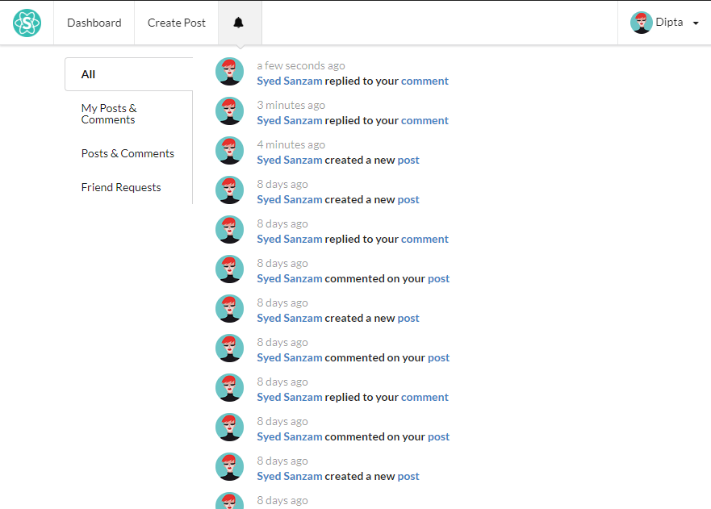

## Coders' Companion:

This project was bootstrapped with [Create React App](https://github.com/facebook/create-react-app).

**Coders' Companion** is a website that helps competitive progammers all over the world lean new programming techniques, share ideas and discuss solutions with the other contestants.

[](https://drive.google.com/file/d/1nH5X-ZN0Ofoo6ph4jc2NqKJyyJW0MaEP/view)

### How to run:

```
npm install
npm start
```

**Tools**: I used **Firestore** to store data online. I used Firebases' **Cloud Functions** To split the client and server side for a small portion of the notification senction.<br>
I've changed the rules to `open` for some testing perposes. Onces it's done, the security issues will be resolved.

### Visit this [link](https://coders-companion-v1.firebaseapp.com/signin) if you want to check the **Multi-level Comment** section.

### `npm start`

Runs the app in the development mode.<br>
Open [http://localhost:3000](http://localhost:3000) to view it in the browser.

### Visit this link to find out ERD, Database Info and 

## Screenshots:

### Dashboard:


### Posts:


### Multi-level Comment Section:


### Notifications:



### ERD:


